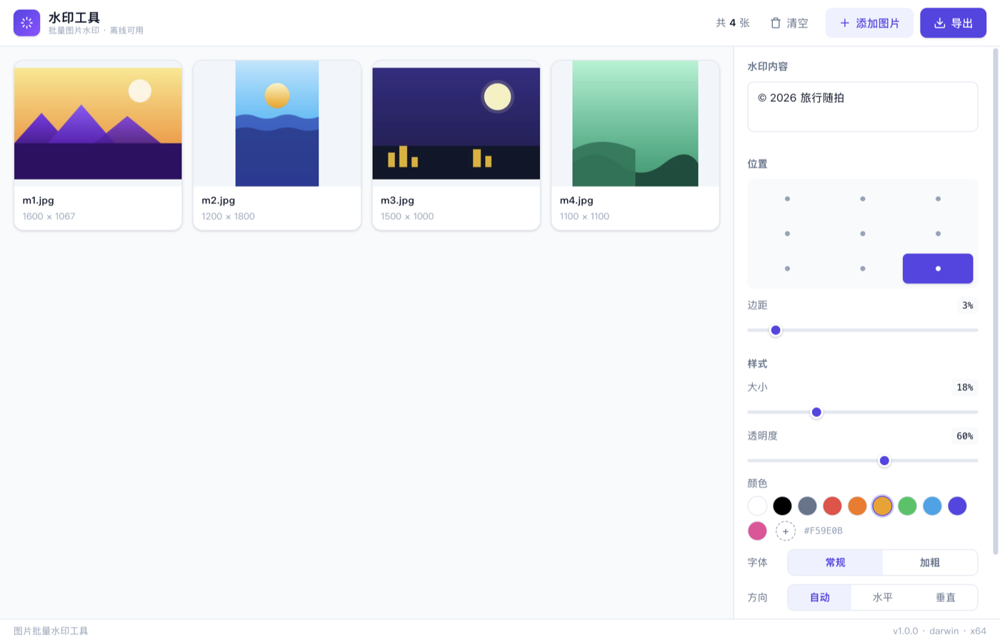

# 水印工具（WaterMark Maker）

跨平台图片批量水印桌面应用（macOS / Windows），独立运行、无需安装任何环境。

## 功能

- 选择一张或多张图片（文件对话框 / 拖拽添加），支持 JPG、PNG、WebP、TIFF、GIF、HEIC
- 水印按图片短边比例自适应大小；竖图自动旋转 90° 垂直排列（自上而下阅读），横图水平排列；9 宫格相对定位适用于任意纵横比
- 可配置：位置（9 宫格）、大小、边距、颜色（预设 + 自定义）、多行文本、透明度、字体字重、旋转策略（自动 / 水平 / 垂直）
- 批量实时预览：网格卡片 + 大图预览即时渲染，调整参数零延迟（不经过 IPC）
- 导出到指定目录，自动重命名：模板 `{name}`、`{ext}`、`{n}`、`{n:3}`、`{count}`、`{date}`、`{time}`；同名冲突自动避让（`_1`、`_2`…）或跳过 / 覆盖
- 异步批量导出（并发 1–4 可调），实时进度、可取消，不阻塞界面
- 内置 Noto Sans CJK SC 字体（GB2312 子集，生僻字回退系统字体），双平台渲染一致；配置自动记忆

## 截图

导入图片后的主界面（实时水印预览）：



大图预览（左右按钮 / 键盘 ←→ 切换，Esc 关闭）：


## 使用

直接运行安装包内的「水印工具」即可。首次打开时：

- **macOS**：由于未签名，Gatekeeper 会拦截 —— 右键（或 Control+点击）应用图标 →「打开」→ 再点「打开」即可；之后可正常双击启动
- **Windows**：SmartScreen 提示时选择「更多信息」→「仍要运行」

## 开发

```bash
npm install          # 安装依赖（首次需手动执行 node node_modules/electron/install.js 若被 npm 拦截）
npm run dev          # 开发模式（HMR）
npm run typecheck    # 类型检查
npm test             # nameResolver 纯函数单测
```

## 打包

```bash
npm run dist:mac     # dmg ×2（Intel x64 + Apple Silicon arm64，按机型选择）
npm run dist:win     # Windows NSIS 安装包（本机交叉打包）
```

产物在 `dist/`。交叉打包前需安装目标平台原生二进制（sharp / resvg-js）：

```bash
npm i --no-save --force \
  @img/sharp-darwin-arm64 @img/sharp-libvips-darwin-arm64 @resvg/resvg-js-darwin-arm64 \
  @img/sharp-win32-x64 @img/sharp-libvips-win32-x64 @resvg/resvg-js-win32-x64-msvc
```

`resources/fonts` 为 GB2312 子集字体（`scripts/subsetFonts.py` 生成，需 `pip3 install --user fonttools`）；如需恢复完整字形或调整字符范围，修改脚本后重新运行并打包。`scripts/afterPack.js` 在打包后删除错架构的原生二进制，减小安装包体积。

## 技术栈

Electron + React 18 + TypeScript + Tailwind v4 · sharp（libvips）· resvg-js（字体渲染，双平台一致）· zustand · @tanstack/react-virtual

## 已知限制

- 不支持 BMP（sharp 预编译 libvips 无 BMP 解码器）
- HEIC 为尽力支持，个别编码变体可能解码失败（会标记为失败并跳过）
- GIF 导出为静态首帧（转 PNG）
- 无代码签名：分发时需按上文绕过系统提示；如需正式分发，配置 Apple 公证 / Windows 代码签名证书后移除 `mac.identity: null` 重新打包
